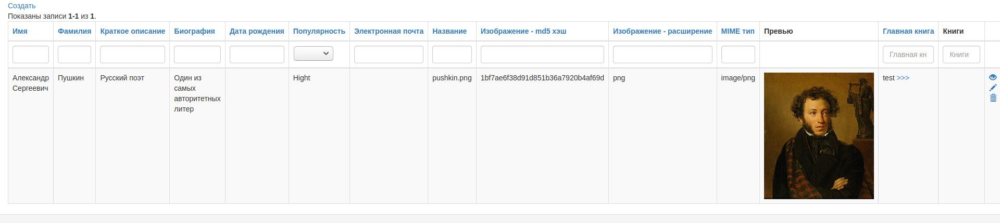
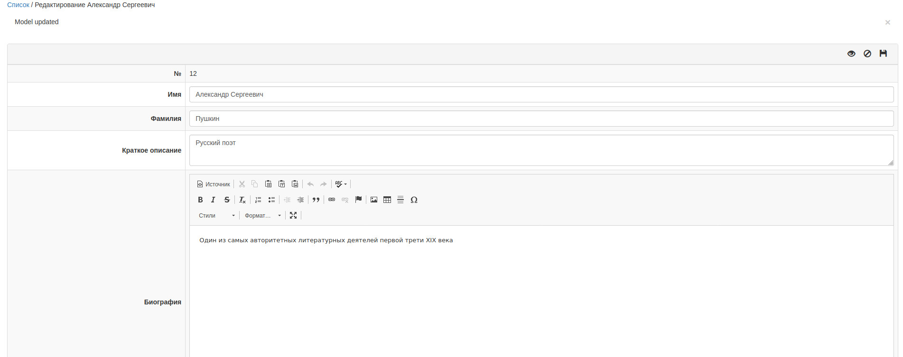
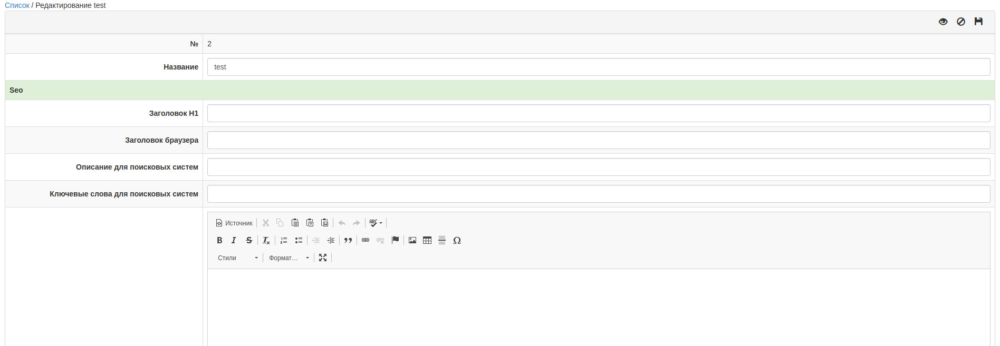

# Yii2 CRUD fields
Этот компонент позволяет автоматизировать многие процессы, которые встречаются в работе с моделями, сократив
тем самым дублирование кода, а отсюда и суммарные временные затраты:
* Написание правил валидации однотипных полей
* Написание геттеров для объявления различных связей с другими моделями
* Валидация и редактирование связанных записей
* Настройка формы редактирования модели и её связанных записей
* Настройка списка записей моделей
* Перевод названий полей
* Добавляет возможность расширения моделей сторонним модулем без добавления новых зависимостей
* Упрощает процесс unit-тестирования моделей

### Простой пример использования
Допустим у нас возникла задача создать CRUD для управления простой моделью Book с двумя полями id и name.
Далее приведён список того, что примерно нужно написать для создания полноценного CRUD управления такими записями.
Вычеркнуто то, что yii2-crud-fields автоматизирует в этом процессе:
1. Класс модели Book
1. Название таблицы путём объявления ```Book::tableName()```
1. Навигация CRUD
1. Контроллер CRUD
    1. Контроль доступа к CRUD
    1. Вывод списка
        1. Действие для вывода списка записей
           1. Загрузку параметров фильтрации
           1. ~~Задать в модели правила валидации для сценария search путём объявления~~ ```Book::rules()```
           1. Валидацию модели по сценарию grid
           1. ~~Формирование ActiveQuery на основе параметров фильтрации~~
           1. ~~Настройка ActiveDataProvider для списка записей~~
           1. Вывод представления 
        1. Представление для вывода списка записей
           1. Вывод кнопки добавления новой записи
           1. ~~Формирование настроек колонок списка~~
           1. Вывод списка записей через виджет [kartik-v/yii2-dynagrid](https://github.com/kartik-v/yii2-dynagrid)
    1. Создание или редактирование записей
        1. Действие для создания или редактирования записей
            1. Если это не новая запись, то поиск активной модели
            1. Если новая, то создание
            1. Задание сценария edit
            1. Загрузка данных модели из запроса
            1. ~~Задать правила валидации модели по сценарию form путём добавления~~ ```Simple::rules()```
            1. Валидация данных модели
            1. Сохранение модели
            1. Вывод ошибок
        1. Представление для вывода формы редактирования активной записи
            1. ~~Формирование настроек аттрибутов для формы редактирования~~
            1. Вывод формы редактирования
    1. Действие для удаления записей

Пример такого CRUD на нативном Yii2 без yii2-crud-fields можно посмотреть в пакете [execut/yii2-books-native](https://github.com/execut/yii2-books-native).
Для демонстрации функционала Yii2 CRUD fields мы будем дорабатывать этот пример путём его расширения.
Уже доработанный с помощью Yii2 CRUD fields CRUD расположен в другом пакете [execut/yii2-books](https://github.com/execut/yii2-books)
и все дальнейшие примеры будут ссылаться на него.

Автоматизация вычеркнутых пунктов достигается путём подключения к модели [Book](https://github.com/execut/yii2-books/blob/master/models/Book.php) характеристики
[execut\crudFields\Behavior](Behavior.php) и поведения [execut\crudFields\BehaviorStub](BehaviorStub.php):
```php
namespace execut\books\models;
class Book extends \yii\db\ActiveRecord {
    use \execut\crudFields\BehaviorStub;
    public function behaviors() {
        return [
            \execut\crudFields\Behavior::KEY => [
                'class' => \execut\crudFields\Behavior::class,
                'fields' => [
                    'id' => [
                        'class' => \execut\crudFields\fields\Id::class,
                    ],
                    'name' => [
                        'class' => \execut\crudFields\fields\StringField::class,
                        'attribute' => 'name',
                        'required' => true,
                    ]
                ],
            ],
        ];
    }
}
```

В результате у нас появляются два поля, которые можно проверить unit-тестом [BookTest](https://github.com/execut/yii2-books/blob/master/tests/unit/models/BookTest.php):
```php
$book = new Book();
$field = $book->getField('id');
$this->assertInstanceOf(\execut\crudFields\fields\Id::class, $field);

$field = $book->getField('name');
$this->assertInstanceOf(\execut\crudFields\fields\StringField::class, $field);
$this->assertTrue($field->required);
```

Модель Book научилась делать всё от неё необходимое для CRUD-а автоматически:
```php
$model = new Book();
echo 'Правила валидации для сценария search и edit';
var_dump($model->rules());
echo 'Формирование ActiveQuery на основе параметров фильтрации и настройка ActiveDataProvider';
var_dump($model->search());
echo 'Формирование настроек колонок списка';
var_dump($model->getGridColumns());
echo 'Формирование настроек формы создания\редактирования';
var_dump($model->getFormFields());
```

Чтобы увидеть преимущества yii2-crud-fields на примере execut/yii2-books-native, можно его доработать, сократив количество кода,
используя yii2-crud-fields:
1. Установите в свой проект [пример CRUD execut/yii2-books-native](https://github.com/execut/yii2-books-native).
1. Замените в нём нативную модель [\execut\booksNative\models\Book](https://github.com/execut/yii2-books-native/blob/master/models/Book.php) на доработанную [\execut\books\models\Book](https://github.com/execut/yii2-books/blob/master/models/Book.php)
путём её подмены в конфигурации приложения:
```php
return [
    'bootstrap' => [
         'booksNative' => [
            'class' => \execut\booksNative\bootstrap\Console::class,
            'moduleConfig' => [
                'bookModelClass' => \execut\books\models\Book::class,
            ]
        ],
    ],
];
```
3. В результате останется тот-же самый CRUD, но с двухкратно упрощённой моделью:
[Было 85 строк](https://github.com/execut/yii2-books-native/blob/master/models/Book.php), а [стало 37](https://github.com/execut/yii2-crud-fields/example/models/Book.php).


Большинство остальных пунктов тоже можно автоматизировать путём использования другого компонента [execut/yii2-crud](https://github.com/execut/yii2-crud)
, что ещё больше сократит дублирование кода между вашими CRUD-ами. Обращайтесь к его [документации](https://github.com/execut/yii2-crud), чтобы понять как это сделать.

Чем разнообразней и больше полей нашей CRUD-модели, тем жирнее и сложнее она становится. С каждым новым типом поля необходимо
писать и дублировать логику по проверке, поиску, выводу колонок и формированию полей формы модели. yii2-crud-fields позволяет
минимизировать такие затраты. Чтобы это рассмотреть в деле, давайте разберём более сложный пример использования.

### Сложный пример использования
Допустим, у наших книг есть авторы и для них нужны следующие поля:

Поле | Тип | Обязательное
-----|-----|-------------
Идентификатор | Id | +
Фамилия | Строка до 255 символов | +
Имя | Строка до 255 символов | +
Кратное описание| Текст | -
Биография|WYSIWYG редактор |  -
Дата рождения|Дата|-
Известность| Выпадающий список с элементами: Низкая, Средняя, Высокая|-
Электронная почта|Email|-
Изображение|Изображение с превьюшкой|-
Основная книга|Выпадающий список с данными из раздела Books|-
Книги|Мультивыпадающий список с данными из раздела Books|-
Дата создания|Дата и время (только для чтения)|+
Дата обновления|Дата и время (только для чтения)|-

Я попытался частично реализовать функционал подобного CRUD-a в виде нативного кода Yii2 в
[этом файле](https://github.com/execut/yii2-books-native/blob/master/models/Author.php).
Чтобы пример корректно заработал необходима поддержка в вашем PHP того формата картинок, который вы хотите загружать в CRUD.

Поскольку при написании нативного примера я устал копировать уже давно написанный код yii2-crud-fields, я намеренно
не сделал некоторые поля (Краткое описание, Биография, Дата рождения, Известность, Электронная почта, Книги), но даже этого кода оказалось больше,
чем в полной реализации с помощью yii2-crud-fields.

Далее я реализовал уже полный функционал подобного CRUD-а в [модели Author](https://github.com/execut/yii2-crud-fields/example/models/Author.php). Чтобы её
установить в пример CRUD execut/yii2-books-native необходимо:
1. Установить в свой проект [пример CRUD execut/yii2-books-native](https://github.com/execut/yii2-books-native).
1. Переключить в нём модель Author [\execut\booksNative\models\Author](https://github.com/execut/yii2-books-native/blob/master/models/Book.php) на доработанную [\execut\books\models\Book](https://github.com/execut/yii2-books/blob/master/models/Author.php)
путём её подмены в конфигурации приложения:
```php
return [
    'bootstrap' => [
         'crudExample' => [
            'class' => \execut\booksNative\bootstrap\Console::class,
            'moduleConfig' => [
                'authorModelClass' => \execut\books\models\Author::class,
            ]
        ],
    ],
];
```
3. В итоге у нас есть написанный более чем в три раза быстрее и компактнее CRUD, при этом имея куда больше возможностей:
[Было 370 строк](https://github.com/execut/yii2-books-native/blob/master/models/Author.php), а [стало 116](https://github.com/execut/yii2-crud-fields/example/models/Author.php).



## Работа со связями
CRUD fields позволяет работать как с обычными связями модели, так и связями, объявленными напрямую в поле. Это сделано
для возможности динамичного управления связями модели и с ними связанными полями. В примере выше используются оба способа
объявления и взаимодействия со связями:
```php
    'mainBook' => [
        'class' => HasOneSelect2::class,
        'attribute' => 'main_book_id',
        'relation' => 'mainBook',
        'relationQuery' => $this->hasOne(Book::class, ['id' => 'main_book_id']),
        'url' => [
            '/crudExample/books'
        ],
    ],
    'books' => [
        'class' => HasManySelect2::class,
        'attribute' => 'books',
        'relation' => 'books',
        'relationQuery' => $this->hasMany(Book::class, ['id' => 'example_book_id'])->via('vsBooks'),
        'url' => [
            '/crudExample/books'
        ],
    ],
```

За счёт этой конфигурации со связями mainBook и books можно работать как с обычными связями в Yii2, например:
```php
// Загружать через ActiveQuery:
$authors = \execut\books\models\Author::find()->with([
    'mainBook',
    'books',
]);
// ...и получать к ним доступ напрямую:
foreach ($authors as $author) {
    if ($author->mainBook) {
        var_dump('Главная книга: ' . $author->mainBook->name);
    }

    foreach ($author->books as $book) {
        var_dump($book->name);
    }
}
```

## I18n
CRUD fields по-умолчанию переводит все названия атрибутов через категорию "execut/module", где module - название модуля, которое характеристика
Behavior попыталась вычислить из namespace вашей модели. Она берёт вторую часть из названия простанства имён. Например,
у модели \execut\crudFields\example\models\Author это crudFields. Таким образом для неё вычисляется алиас "execut/crudFields".
Чтобы переназначить вычисленный module, укажите его как параметр module Behavior в behaviors модели или напрямую в field:
```php
    public function behaviors() {
        return [
            \execut\crudFields\Behavior::KEY => [
                //...
                'module' => 'Требуемый модуль',
                'fields' => [
                    'test' => [
                        //...
                        'module' => 'Второй модуль',
                    ]
                ]
            ]
        ];
    }
```


## Динамичные поля
Иногда возникает необходимость менять содержимое полей формы "на лету". Для этого для полей были сделаны
перезагрузчики.

Внимание! Для работы динамических полей необходимо использовать расширенный DetailView (\execut\actions\widgets\DetailView) из пакета [execut/yii2-actions](https://github.com/execut/yii2-actions).
В будущем планируется вынести этот виджет в отдельный пакет и подключить его к yii2-crud-fields.

### Перезагрузчики полей
У нас есть поле для отображения времени прибытия машины с грузом:
```php
$finishTimeField = new \execut\crudFields\fields\Date([
    'attribute' => 'finish_time',
    'isTime' => true,
]);
```
Допустим, нам необходимо постоянно видеть свежее время её прибытия без обновления страницы. Чтобы это реализовать, необходимо создать и
подключить к полю перезагрузчик с типом Periodically:
```php
$periodicallyType = new \execut\crudFields\fields\reloader\type\Periodically();
$finishTimeReloader = new \execut\crudFields\fields\reloader\Reloader($periodicallyType);
$finishTimeField->setReloaders([$finishTimeReloader]);
```
После этого поле станет периодически обновляться раз в 10 секунд.

Допустим нам нужно его обновлять только тогда, когда машина находится в пути.
```php
// Для этого создаём само поле статуса
$statusField = new \execut\crudFields\fields\DropDown([
    'attribute' => 'status',
    'data' => [
        'going' => 'В пути',
        'arrived' => 'Прибыла',
    ],
]);
// Указываем ему, что необходимо периодически обновлять статус
$statusReloader = new \execut\crudFields\fields\reloader\Reloader($periodicallyType);
$statusField->setReloaders([$statusReloader]);

// Создаём цель для того, чтобы перезагрузчик срабатывал когда статус машины является going
$finishTimeTarget = new \execut\crudFields\fields\reloader\Target($statusField);
$finishTimeTarget->setValues(['going']);
// Указываем, чтобы время прибытие обновлялось только тогда, когда статус машины "В пути"
$finishTimeReloader->setTargets([$finishTimeTarget]);
```
В результате поле статуса и время прибытия будут обновляться раз в 10 секунд, при этом время прибытия будет делать это
только когда статус машины "В пути"

### Взаимозависимые поля
Иногда нужно сделать так, чтобы одни поля зависели от значения других. Хороший пример - это поля моделей и марок наших
машин. Нам необходимо, чтобы список моделей менялся когда мы выбираем другую марку:
```php
$markField = new \execut\crudFields\fields\DropDown([
    'attribute' => 'cars_mark_id',
    'relationName' => 'mark',
    'relationQuery' => $this->hasOne(Mark::class, ['id' => 'cars_mark_id']),
]);
$modelField = new \execut\crudFields\fields\DropDown([
    'attribute' => 'cars_model_id',
    'relationName' => 'model',
    'relationQuery' => $this->hasOne(Model::class, ['id' => 'cars_model_id']),
    'data' => $this->getModelsListByMark(),
]);

// Создаём тип обновления - зависимый
$type = new \execut\crudFields\fields\reloader\type\Dependent();

// Задаём, что поле модели необходимо обновлять когда меняется марка:
$target = new \execut\crudFields\fields\reloader\Target($markField);

$reloader = new \execut\crudFields\fields\reloader\Reloader($type, [$target]);
$modelField->setReloaders([$reloader]);
```
После таких манипуляций наше поле модели будет фильтровать свой список после изменения марки.

## Реализованные поля
Далее приведён список уже реализованных типичных полей. В будущем со временем напишу отдельную документацию по каждому.
Все классы этих полей расположены в папке ```fields```

Тип | Название | Описание
----|---------|-------------
Стандартный | Boolean | Флажок
Стандартный, Связи: к одному | DropDown | Выпадающий список
Стандартный | Email | Электронная почта
Стандартный | Field | Обычный текст
Стандартный | Group | Название группы полей
Стандартный | Hidden | Скрытое поле
Стандартный | Id | Идентификатор, первичный ключ
Стандартный | Password | Пароль
Стандартный | RadiobuttonGroup | Радио кнопки
Стандартный | StringField | Строка
Стандартный | Textarea | Строка
Дата и время | Time | Время
Дата и время | Date | Дата
Число | FloatField | Вещественное число
Число | NumberField | Целое число 
Связи: ко многому | CheckboxList | Список флажков
Связи: ко многому | HasManyMultipleInput | Вложенная мультиформа
Связи: ко многому | HasManySelect2 | Выпадающий мультисписок
Связи: к одному | HasOneDepDrop | Зависящий выпадающий  список [kartik-v/dependent-dropdown](https://github.com/kartik-v/dependent-dropdown)
Связи: к одному | HasOneRadioList | Радио кнопки для выбора записей связей
Связи: к одному | HasOneSelect2 | Выпадающий список [kartik-v/yii2-widget-select2](https://github.com/kartik-v/yii2-widget-select2)
Связи: все виды | RelationsFilterField | Фильтрация по факту наличия или отсутсвия связанных записей
Связи: все виды | RelationValue | Вывод всех значений полей связанных записей
Файлы | File | Файл
Файлы | Image | Изображение
Виджет | AutoresizeTextarea | Поле для текста с автоматически изменяемым размером. Пакет этого виджета находится здесь [execut/yii2-autosize-textarea](https://github.com/execut/yii2-autosize-textarea)
Виджет | Editor | WYSIWYG-редактор
Виджет | PasswordWidget | Пароль с виджетом проверки сложности пароля [kartik-v/yii2-password](https://github.com/kartik-v/yii2-password)
Виджет | ProgressBar | Полоса прогресса
Особый | CompleteTime | Поле для вывода рассчётного времени завершения какого-либо процесса
Особый | RawField | Поле для отображение текста
Особый | Translit | Транслитерируемое значение
Особый | Action | Вывод колонки действий для списка записей

### Система плагинов
Допустим, мы хотим сделать в простом примере c книгами поля, необходимые для вывода seo-метатегов книги на сайте.
Причём так, чтобы модель Book не знала об этом. Это необходимо для того, чтобы:
* разделить бизнес-логику модуля, отвечающего за книги и модуля, отвечающего за SEO
* исключить дублирование функционала работы с SEO-полями
* оставить модель Book такой-же простой как и раньше

С данной целью мы будем подключать к модели Book плагин [Fields](https://github.com/execut/yii2-seo/blob/master/crudFields/Fields.php)
из пакета [execut/yii2-seo](https://github.com/execut/yii2-seo). Чтобы было возможно его подключить к нашему примеру
через настройки приложения, необходимо расширить модуль execut\books\Module, добавив туда параметр booksPlugins для подключения
плагинов раздела книг:
```php
<?php
namespace execut\books;
class BooksModule extends \execut\booksNative\Module
{
    public $controllerNamespace = 'execut\booksNative\controllers';
    public $booksPlugins = [];
}
```
Затем расширяем модель книг Book до [BookPluggable](https://github.com/execut/yii2-books/blob/master/models/BookPluggable.php) для возможности подключать к ней плагины из конфигурации своего модуля:
```php
namespace execut\books\models;
use execut\crudFields\Behavior;
use yii\helpers\ArrayHelper;

class BookPluggable extends Book
{
    public function behaviors()
    {
        return ArrayHelper::merge(parent::behaviors(), [
            Behavior::KEY => [
                'plugins' => \yii::$app->getModule('crudExample')->booksPlugins,
            ]
        ]);
    }
}
```

Можно было обойтись без отдельной модели, но для чистоты первого примера был выбран путь с наследованием.

Теперь мы подготовили модуль [execut/yii2-books](https://github.com/execut/yii2-books) для подключения сторонних плагинов. Далее, чтобы нам расширять модуль yii2-books
без лишней связанности, будем писать весь код, связывающий [execut/yii2-seo](https://github.com/execut/yii2-seo) и [execut/yii2-books](https://github.com/execut/yii2-books) в рамках отдельного
интеграционного модуля [execut/yii2-books-seo](https://github.com/execut/yii2-books-seo).

Создаём в нём миграцию для добавления SEO полей:
```php
<?php
namespace execut\booksSeo\migrations;

use execut\seo\migrations\AddFieldsHelper;
use execut\yii\migration\Migration;
use execut\yii\migration\Inverter;
class m200714_140947_addSeoExampleFields extends Migration
{
    public function initInverter(Inverter $i)
    {
        $helper = new AddFieldsHelper([
            'table' => $i->table('example_books'),
        ]);
        $helper->attach();
    }
}
```

И применяем её
```shell script
./yii migrate/up --migrationPath=vendor/execut/yii2-books-seo/migrations --interactive=0
```

Затем собираем всё это дело в конфигурацию backend приложения:
```php
return [
    'bootstrap' => [
        'crudExample' => [
            'class' => \execut\booksNative\bootstrap\Common::class,
            'moduleConfig' => [
                'class' => \execut\books\BooksModule::class,
                'bookModelClass' => \execut\books\models\BookPluggable::class,
                'booksPlugins' => [
                    [
                        'class' => \execut\seo\crudFields\Fields::class,
                    ],
                ],
            ]
        ],
    ]
];
```
И у нас должна появится новая группа полей SEO:


Плагин от [execut\seo\crudFields\Fields](https://github.com/execut/yii2-seo/blob/master/crudFields/Fields.php) наследует абстрактный класс для
плагинов [execut\crudFields\Plugin](https://github.com/execut/yii2-crud-fields/blob/master/Plugin.php) и переопределяет
в нём метод _getFields, который возвращает массив с конфигурацией новых полей.

Так-же в плагинах можно задать ряд свойств и переопределить другие методы: 
* **owner**: _Model_, через это свойство можно обратиться к экземпляру модели, которую плагин расширяет. Может понадобиться
в любом месте плагина
* **initDataProvider(DataProviderInterface $dataProvider)**: может потребоваться для инициализации поставщика данных модели,
например для увеличения размера страницы в списке CRUD
* **applyScopes(ActiveQuery $q)**: для инициализирования запроса, например, для добавления новых условий или выборок.
* **attach()**: для необходимости что либо произвести перед подключением плагина к модели
* и методы для перехвата одноимённых событий ActiveRecord
    * **afterUpdate()**
    * **afterInsert()**
    * **beforeValidate()**
    * **afterValidate()**
    * **beforeUpdate()**
    * **beforeInsert()**
    * **beforeSave()**
    * **afterSave()**
    * **beforeDelete()**
    * **afterLoad()**